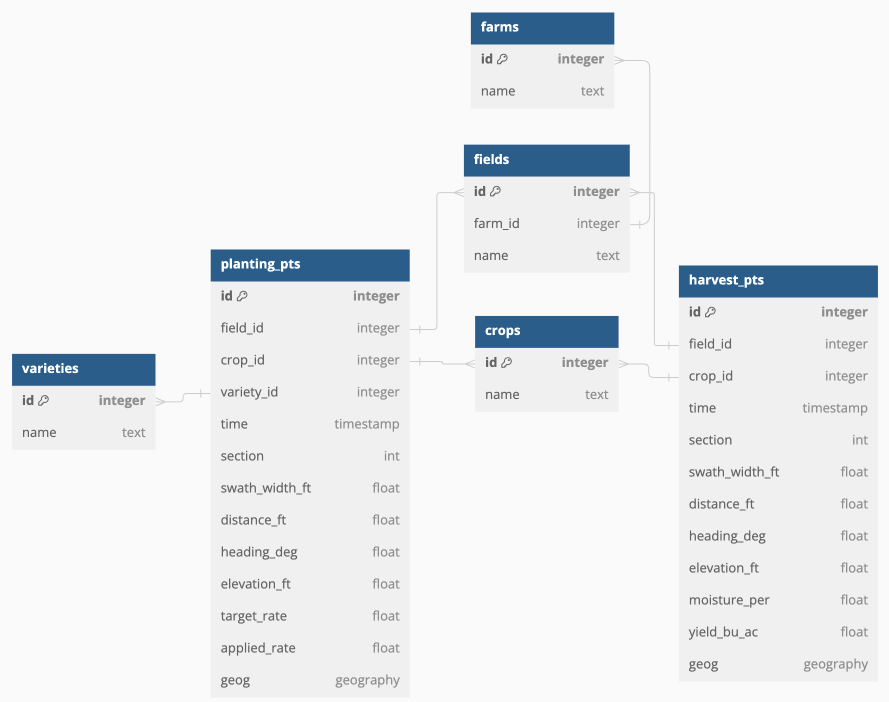
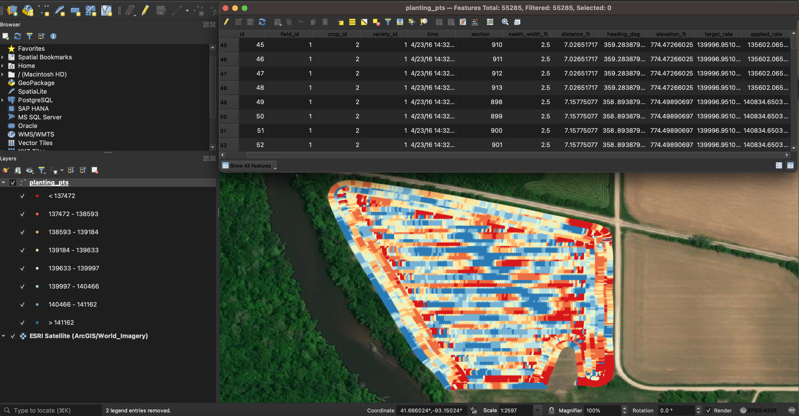
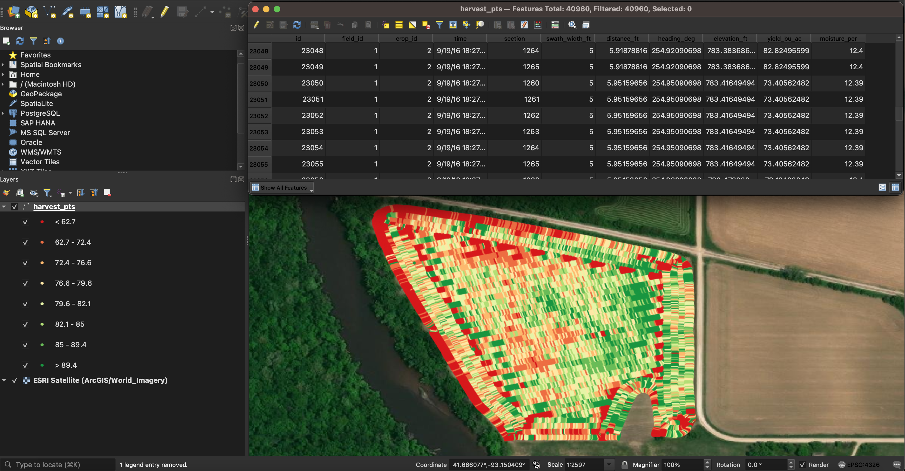

# go_geo_example

## Objective
This repository is a code sample for an ETL pipeline that extracts, transforms, and loads geospatial agronomic data into a PostGIS database using the Go programming language.  

## Dependencies
Docker Desktop or Docker Engine as well as the command line utility make are required to execute the pipleine.

## Pipeline Execution
To execute the pipeline, run the following in a terminal:

```sh
cd path/to/go_geo_example
make docker
make ubuntu/attach
make db/init go/build
geo load --dir ./assets/example_data
```

## Tech Stack
The pipeline was engineered using Docker Compose, Make, Go, and SQL. Docker Compose was used to create an environment with a Ubuntu Server for executing the pipeline, a PostgreSQL/PostGIS instance for storing the geospatial data in a relational database, volumes for data storage, and a network that allows these components to communicate with each other. A Go command line interface (CLI) was developed to conduct the ETL pipeline while SQL was used to create the relational database. Make was used to define tasks necessary to execute the pipeline.

## Database

### Schema
The schema for the PostgreSQL/PostGIS instance is depicted below.  The farm is the top level model. Each farm has many fields, and each field has many harvest_pts and planting_pts. A farm represents a business that manages multiple fields. A field is a parcel of land that is farmed.  planting_pts and harvest_pts represent spatial point geometry data collected from planters and harvesters, repsectively, on a particular field.  Each planting_pt and harvest_pt belongs to a single crop indicating the crop that was planted or harvested, respectively.  Further, each planting_pt belongs to a single variety that indicates the variety of the seed that was planted.



### Initialize
The ./scripts/init_db.sql SQL script contains the logic for initializing the database.  To initialize the database:

```sh
make ubuntu/attach
make db/init
```

## Data Sources
This pipeline was engineered to load data exported from MyJohnDeere Operations Center.  The example data in ./assets/example_data was taken from [here](https://github.com/JohnDeere/SampleData/tree/master/Shapefiles). Specifically, the planting data is found [here](https://github.com/JohnDeere/SampleData/blob/master/Shapefiles/Export%20From%20MyJohnDeere%20-%20Seeding.zip) and the harvest data is found [here](https://github.com/JohnDeere/SampleData/blob/master/Shapefiles/Export%20From%20MyJohnDeere%20-%20Harvest.zip). The data directory input to the Go CLI must have the following structure:

```console
data_dir
├── Harvest
│   ├── *.dbf
│   ├── *.json
│   ├── *.prj
│   ├── *.shp
│   └── *.shx
└── Planting
    ├── *.dbf
    ├── *.json
    ├── *.prj
    ├── *.shp
    └── *.shx
```

## Go Command Line Interface

### Build
The application code for the Go CLI is located in ./geo. To build the binary and add it to the $GOBIN directory:

```sh
make docker/attach
make go/build
```

### Execute
To execute the loader via the command line after it has been built:

```sh
make docker/attach
geo load ./assets/example_data
```

Below is an example of the output during loader execution:

```console
Loading MyJohnDeere data from ./assets/example_data
Parsing metadata from assets/example_data/Planting/Merriweather Farms-JT-01-Soybeans-Deere-Metadata.json
Farm: JT
Field: 01
Crop: Soybeans
Loading planting data from assets/example_data/Planting/Merriweather Farms-JT-01-Soybeans.shp
Loading harvest data from assets/example_data/Harvest/Merriweather Farms-JT-01-Soybeans.shp
55285 of 55285 planting points loaded.
40960 of 40960 harvest points loaded.
Load complete!
```

The data loaded into PostGIS can also be viewed in QGIS (Figures 1 and 2).


**Figure 1.** Planting data viewed in QGIS and symbolized by applied seeds per acre. Red indicates a lower number of seeds applied per acre while blue indicates a higher number of seeds applied per acre.


**Figure 2.** Harvest data viewed in QGIS and symbolized by crop yield in bushels per acre. Red indicates low crop yield while green indicates high crop yield.

### Debug
To debug via VSCode:

1. Install Go on your machine.  
2. Install the Go VSCode extension.  
3. Attach to the ubuntu container and start the debugger:
    ```sh
    make ubuntu/attach
    make go/debug
    ```
4. Finally, Run and Debug from VSCode.
